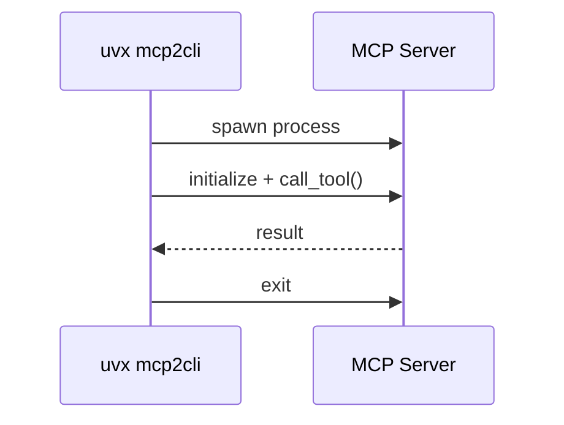
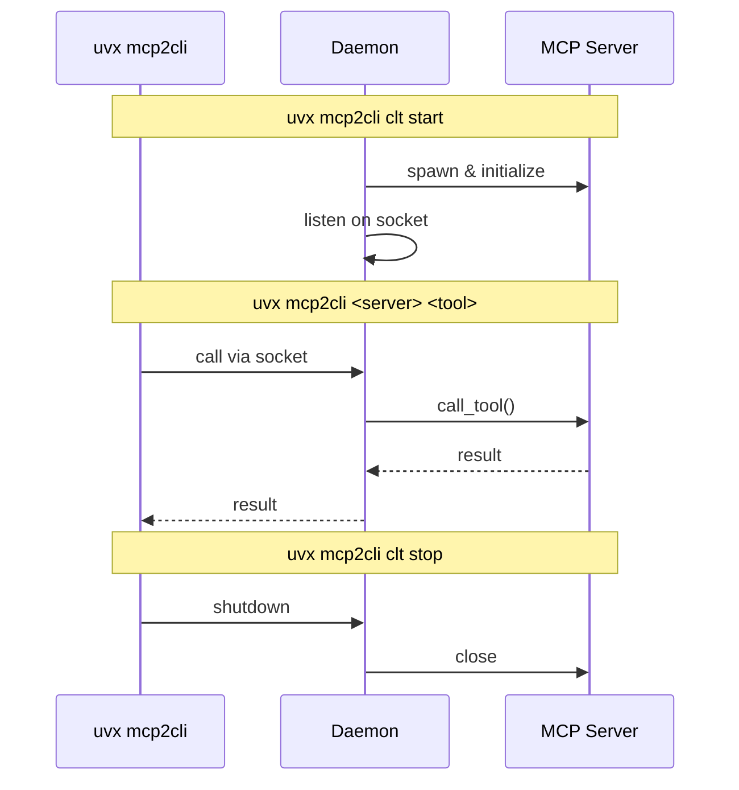

# mcp2cli

**Skip MCP. Enjoy CLI.**

Use MCP server tools directly from your terminal. Perfect for scripting, automation, and agentic workflows.

**Compatibility:** Expected to work with most MCP servers out of the box—just point it at any stdio-based MCP server and go.

## Quick Start

```bash
# 1. Configure your MCP servers in .mcp2cli/.mcp.json
# 2. Initialize a server (discovers available tools)
uvx mcp2cli clt init <server>

# 3. Call tools directly
uvx mcp2cli <server> <tool> [OPTIONS]
```

## Why mcp2cli?

MCP servers offer powerful, structured tools. But the MCP protocol loads large tool schemas and verbose data into AI context—expensive in tokens, slow in practice.

CLI is leaner. It avoids loading tool schemas and verbose outputs into model context.

mcp2cli gives you direct CLI access to MCP server tools. Same tools, no protocol overhead.

Not every MCP server has an official CLI. Rather than waiting, mcp2cli lets you use existing MCP servers as CLIs right now.

See [Playwright CLI vs MCP](https://github.com/microsoft/playwright-mcp#cli-mode-vs-mcp-mode) for a similar motivation.

## Usage

### Server Management

```bash
uvx mcp2cli clt init <server>      # Initialize and discover tools (--force to reinitialize)
uvx mcp2cli clt list               # List servers with status
uvx mcp2cli clt start <server>     # Start persistent daemon
uvx mcp2cli clt stop <server>      # Stop daemon
```

### Calling Tools

Argument names match the MCP tool schema exactly (e.g., `libraryId` becomes `--libraryId`).

```bash
# Basic call
uvx mcp2cli <server> <tool> --arg1 "value"

# Output as JSON (flag before tool name)
uvx mcp2cli <server> --json <tool> --arg1 "value"

# Save to file (flag before tool name)
uvx mcp2cli <server> --output result.json <tool> --arg1 "value"

# Save to directory (auto-generates filename: {server}_{tool}_{timestamp}.json)
uvx mcp2cli <server> --output ./output_dir/ <tool> --arg1 "value"

# View available tools
uvx mcp2cli <server> --help

# View tool options
uvx mcp2cli <server> <tool> --help
```

## Execution Modes

### On-Demand Mode

Each tool call spawns a new MCP server, executes the tool, and exits.

**When to use:** The MCP server starts quickly, tool calls are infrequent, or the server is stateless. Avoids keeping extra processes running.



### Daemon Mode

A daemon process keeps the MCP server running. Tool calls connect via Unix socket.

**When to use:** Making many tool calls in succession, the server has slow startup, or the server maintains state between calls.



## Configuration

### MCP Servers Config (`.mcp2cli/.mcp.json`)

Follows the standard MCP config format. Add as many servers as needed (local or global at `~/.mcp2cli/.mcp.json`):

```json
{
  "mcpServers": {
    "chrome-devtools": {
      "command": "npx",
      "args": ["-y", "@anthropic/chrome-devtools-mcp@latest"]
    },
    "context7": {
      "command": "npx",
      "args": ["-y", "@upstash/context7-mcp@latest"]
    }
  }
}
```

## Features

### Auto-Dump

Automatically save large outputs to files, keeping Agent context (and your terminal) clean.

Configure in `.mcp2cli/.settings.json`:

```json
{
  "dump_dir": "mcp2cli_output",
  "servers": {
    "context7": {
      "dump_threshold": 500
    }
  }
}
```

When a response exceeds `dump_threshold` tokens (1 token ≈ 4 characters), it's saved to `dump_dir` instead of printed. Set to `0` to always dump.

For small responses, dumping to file adds overhead—reading from a file may cost more than just receiving the result directly. Set a threshold that makes sense for your workflow. See [Use Case: Context7](#use-case-context7).

### Include Call Args in Dumps

Add the tool call arguments to dump files for traceability.

```json
{
  "dump_call_args": true
}
```

Useful when an AI agent pulls data that won't change during its run (like documentation). The dumps become a cache the agent can refer back to without re-fetching.

Can also be set per-server via `servers.<name>.dump_call_args`.

## Use Case: Context7

[Context7](https://github.com/upstash/context7) is an MCP server that pulls up-to-date documentation and code examples for libraries (React, Next.js, etc.). It outputs **5,000+ tokens** per query—great for context, expensive when loaded into AI prompts repeatedly.

**The problem:** Every query dumps thousands of tokens into your AI's context window. Without careful context management (like sub-agents or regular compactions), the context window will suffer.

### Setup

```json
// .mcp2cli/.mcp.json
{
  "mcpServers": {
    "context7": {
      "command": "npx",
      "args": ["-y", "@upstash/context7-mcp@latest"]
    }
  }
}
```

### Auto-Dump Setup

```json
// .mcp2cli/.settings.json
{
  "dump_dir": "docs_output",
  "dump_threshold": 0,
  "servers": {
    "context7": {
      "dump_threshold": 0
    }
  }
}
```

### Usage

```bash
# Initialize
uvx mcp2cli clt init context7

# Query docs - automatically saved to docs_output/
uvx mcp2cli context7 query-docs --libraryId "/vercel/next.js" --query "app router"
```

With `dump_threshold: 0`, every Context7 response saves to `docs_output/`, keeping your AI context lean while preserving full documentation access.

## Status

Under active development.

## License

MIT
