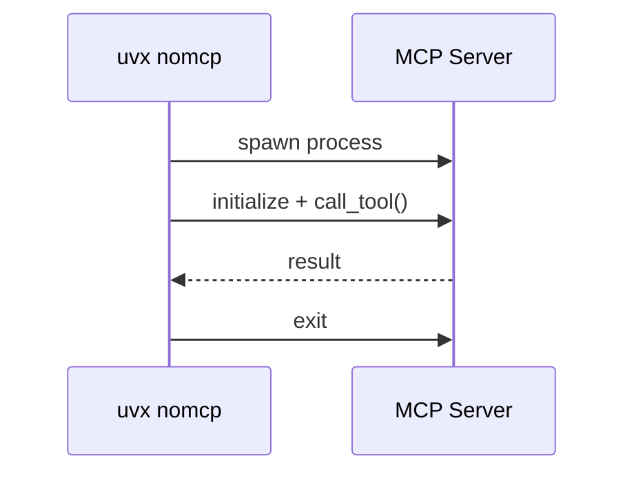
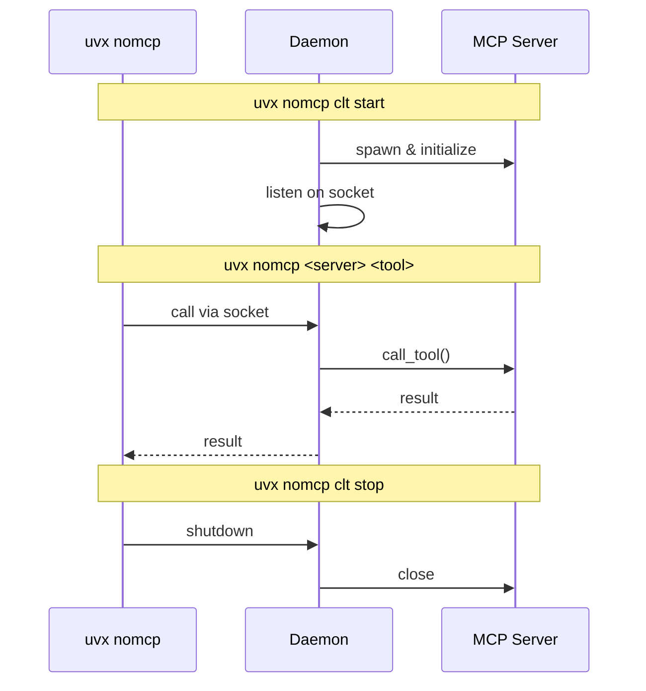

# noMCP

**Skip MCP. Enjoy CLI.**

Use MCP server tools directly from your terminal. Perfect for scripting, automation, and agentic workflows.

## Quick Start

```bash
# 1. Configure your MCP servers in .nomcp/.mcp.json
# 2. Initialize a server (discovers available tools)
uvx nomcp clt init <server>

# 3. Call tools directly
uvx nomcp <server> <tool> [OPTIONS]
```

## Why noMCP?

MCP servers offer powerful, structured tools. But the MCP protocol loads large tool schemas and verbose data into AI context—expensive in tokens, slow in practice.

CLI is leaner. It avoids loading tool schemas and verbose outputs into model context.

noMCP gives you direct CLI access to MCP server tools. Same tools, no protocol overhead.

Not every MCP server has an official CLI. Rather than waiting, noMCP lets you use existing MCP servers as CLIs right now.

See [Playwright CLI vs MCP](https://github.com/microsoft/playwright-mcp#cli-mode-vs-mcp-mode) for a similar motivation.

## Usage

### Server Management

```bash
uvx nomcp clt init <server>      # Initialize and discover tools (--force to reinitialize)
uvx nomcp clt list               # List servers with status
uvx nomcp clt start <server>     # Start persistent daemon
uvx nomcp clt stop <server>      # Stop daemon
```

### Calling Tools

Argument names match the MCP tool schema exactly (e.g., `libraryId` becomes `--libraryId`).

```bash
# Basic call
uvx nomcp <server> <tool> --arg1 "value"

# Output as JSON (flag before tool name)
uvx nomcp <server> --json <tool> --arg1 "value"

# Save to file (flag before tool name)
uvx nomcp <server> --output result.json <tool> --arg1 "value"

# Save to directory (auto-generates filename: {server}_{tool}_{timestamp}.json)
uvx nomcp <server> --output ./output_dir/ <tool> --arg1 "value"

# View available tools
uvx nomcp <server> --help

# View tool options
uvx nomcp <server> <tool> --help
```

## Execution Modes

### On-Demand Mode

Each tool call spawns a new MCP server, executes the tool, and exits.

**When to use:** The MCP server starts quickly, tool calls are infrequent, or the server is stateless. Avoids keeping extra processes running.



### Daemon Mode

A daemon process keeps the MCP server running. Tool calls connect via Unix socket.

**When to use:** Making many tool calls in succession, the server has slow startup, or the server maintains state between calls.



## Configuration

### MCP Servers Config (`.nomcp/.mcp.json`)

Follows the standard MCP config format. Add as many servers as needed (local or global at `~/.nomcp/.mcp.json`):

```json
{
  "mcpServers": {
    "chrome-devtools": {
      "command": "npx",
      "args": ["-y", "@anthropic/chrome-devtools-mcp@latest"]
    },
    "context7": {
      "command": "npx",
      "args": ["-y", "@upstash/context7-mcp@latest"]
    }
  }
}
```

## Features

### Auto-Dump

Automatically save large outputs to files, keeping Agent context (and your terminal) clean.

Configure in `.nomcp/.settings.json`:

```json
{
  "dump_dir": "nomcp_output",
  "servers": {
    "context7": {
      "dump_threshold": 500
    }
  }
}
```

When a response exceeds `dump_threshold` tokens (1 token ≈ 4 characters), it's saved to `dump_dir` instead of printed. Set to `0` to always dump.

For small responses, dumping to file adds overhead—reading from a file may cost more than just receiving the result directly. Set a threshold that makes sense for your workflow. See [Use Case: Context7](#use-case-context7).

### Include Call Args in Dumps

Add the tool call arguments to dump files for traceability.

```json
{
  "dump_call_args": true
}
```

Useful when an AI agent pulls data that won't change during its run (like documentation). The dumps become a cache the agent can refer back to without re-fetching.

Can also be set per-server via `servers.<name>.dump_call_args`.

## Use Case: Context7

[Context7](https://github.com/upstash/context7) is an MCP server that pulls up-to-date documentation and code examples for libraries (React, Next.js, etc.). It outputs **5,000+ tokens** per query—great for context, expensive when loaded into AI prompts repeatedly.

**The problem:** Every query dumps thousands of tokens into your AI's context window. Without careful context management (like sub-agents or regular compactions), the context window will suffer.

### Setup

```json
// .nomcp/.mcp.json
{
  "mcpServers": {
    "context7": {
      "command": "npx",
      "args": ["-y", "@upstash/context7-mcp@latest"]
    }
  }
}
```

```json
// .nomcp/.settings.json
{
  "servers": {
    "context7": {
      "dump_threshold": 500,
      "dump_call_args": true
    }
  }
}
```

### Usage

We use on-demand mode here since Context7 doesn't hold meaningful state between calls—it just fetches docs. For stateful servers like Chrome DevTools MCP (which maintains browser session state), daemon mode would be the better choice.

```bash
# Initialize
uvx nomcp clt init context7

# Query docs - automatically saved to feature-x-tmp/
uvx nomcp context7 --output feature-x-tmp query-docs --libraryId "/vercel/next.js" --query "app router"
```

```
$ uvx nomcp context7 --help
Usage: nomcp context7 [OPTIONS] COMMAND [ARGS]...

  Tools for context7 server

Options:
  --json         Output raw JSON response.
  --output PATH  Write JSON result to file.
  --help         Show this message and exit.

Commands:
  query-docs          Retrieves and queries up-to-date documentation and...
  resolve-library-id  Resolves a package/product name to a...
```

```
$ uvx nomcp context7 --output feature-x-tmp query-docs --libraryId /vercel/next.js --query "How to set up authentication with JWT"
Tool executed successfully.
Tool output written to: feature-x-tmp/context7_query-docs_20260131_194608.json
```

```json
// feature-x-tmp/context7_query-docs_20260131_194608.json
{
  "tool_call": {
    "server": "context7",
    "tool": "query-docs",
    "arguments": {
      "libraryId": "/vercel/next.js",
      "query": "How to set up authentication with JWT"
    }
  },
  "response": {
    "content": [
      {
        "type": "text",
        "text": "### Encrypt and Decrypt Sessions with Jose in Next.js\n\n
                Source: https://github.com/vercel/next.js/blob/canary/docs/...\n\n
                Implements JWT-based session encryption and decryption using
                the Jose library with HS256 algorithm...\n\n
                ```typescript\nimport 'server-only'\nimport { SignJWT, jwtVerify }
                from 'jose'\n...```\n\n
                --------------------------------\n\n
                ### Set Encrypted Session Cookie in Next.js...\n\n
                ... (5000+ tokens of documentation)"
      }
    ],
    "isError": false
  }
}
```

With `dump_call_args: true`, the output includes the exact tool call arguments. This turns output files into a cache that AI agents can refer back to—no need to re-fetch the same documentation during a session.

```
$ uvx nomcp context7 query-docs --help
Usage: nomcp context7 query-docs [OPTIONS]

  Retrieves and queries up-to-date documentation and code examples from
  Context7 for any programming library or framework.

  You must call 'resolve-library-id' first to obtain the exact
  Context7-compatible library ID required to use this tool, UNLESS the user
  explicitly provides a library ID in the format '/org/project' or
  '/org/project/version' in their query.

  IMPORTANT: Do not call this tool more than 3 times per question. If you
  cannot find what you need after 3 calls, use the best information you have.

Options:
  --libraryId TEXT  Exact Context7-compatible library ID (e.g.,
                    '/mongodb/docs', '/vercel/next.js', '/supabase/supabase',
                    '/vercel/next.js/v14.3.0-canary.87') retrieved from
                    'resolve-library-id' or directly from user query in the
                    format '/org/project' or '/org/project/version'.
                    [required]
  --query TEXT      The question or task you need help with. Be specific and
                    include relevant details. Good: 'How to set up
                    authentication with JWT in Express.js' or 'React useEffect
                    cleanup function examples'. Bad: 'auth' or 'hooks'.
                    IMPORTANT: Do not include any sensitive or confidential
                    information such as API keys, passwords, credentials, or
                    personal data in your query.  [required]
  --help            Show this message and exit.
```

With `dump_threshold: 0`, every Context7 response saves to `docs_output/`, keeping your AI context lean while preserving full documentation access.

## Status

Under active development.

## License

MIT
