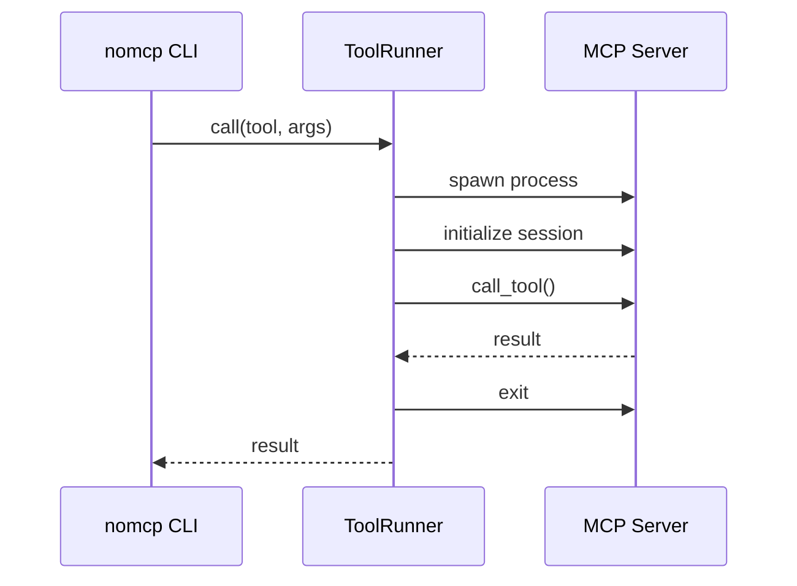
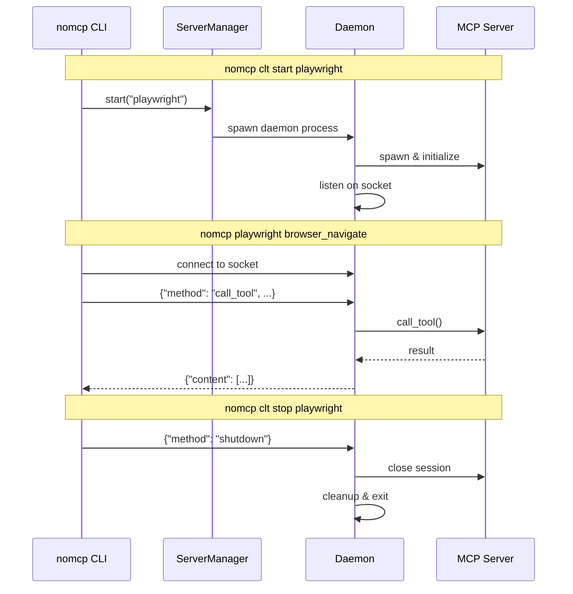
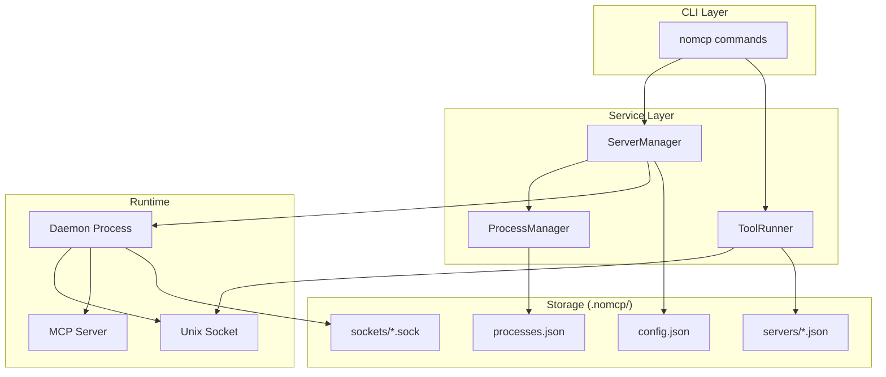

# noMCP

**Skip MCP. Enjoy CLI.**

Use MCP server tools directly from your terminal. Perfect for scripting, automation, and agentic workflows.

## Install

```bash
pip install nomcp
```

## Quick Start

```bash
# Configure your MCP servers in .nomcp/config.json
nomcp clt init playwright     # Initialize a server
nomcp playwright <tool>       # Run tools directly
```

## Persistent Mode

By default, each tool call spawns a new MCP server process. For faster repeated calls, use persistent mode:

```bash
nomcp clt start playwright    # Start server persistently
nomcp playwright <tool>       # Fast: reuses running server
nomcp playwright <tool>       # Fast: still reusing
nomcp clt stop playwright     # Stop when done
```

## Config

```json
{
  "mcpServers": {
    "playwright": {
      "command": "npx",
      "args": ["@playwright/mcp@latest"]
    }
  }
}
```

## Why noMCP?

MCP servers offer powerful, structured tools. But the MCP protocol loads large tool schemas and verbose data into AI context—expensive in tokens, slow in practice.

CLI is leaner. It avoids loading tool schemas and verbose outputs into model context.

noMCP gives you direct CLI access to MCP server tools. Same tools, no protocol overhead.

See [Playwright CLI vs MCP](https://github.com/microsoft/playwright-mcp#cli-mode-vs-mcp-mode) for a similar motivation.

## Why this tool?

Not every MCP server has an official CLI. Rather than waiting, noMCP lets you use existing MCP servers as CLIs right now.

## Architecture

### On-Demand Mode (Default)

Each tool call spawns a new MCP server, executes the tool, and exits:



### Persistent Mode

A daemon process keeps the MCP server running. Tool calls connect via Unix socket:



### Component Overview



### File Structure

```
.nomcp/
├── config.json          # Server configurations
├── processes.json       # Running process registry
├── servers/
│   └── playwright.json  # Cached tools per server
└── sockets/
    └── playwright.sock  # Unix socket (persistent mode)
```

## Status

Under active development.

## License

MIT
